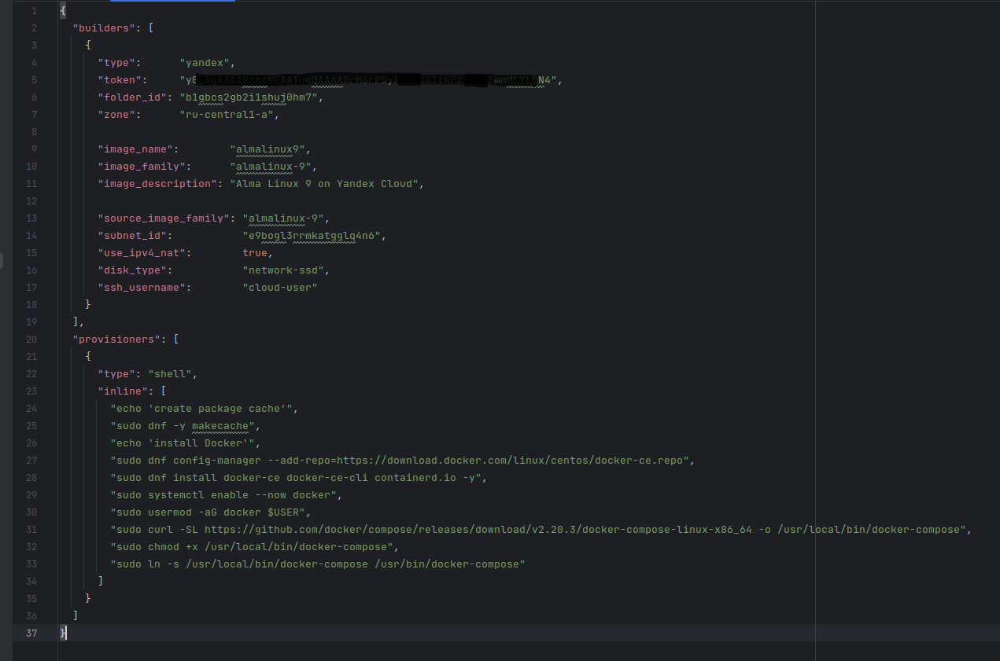
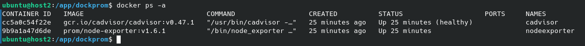

# Автор: Федорчук Дмитрий Сергеевич DEVOPS-33

# Домашнее задание к занятию 4. «Оркестрация группой Docker-контейнеров на примере Docker Compose»

## Задача 1

Создайте собственный образ любой операционной системы (например, debian-11) с помощью Packer версии 1.5.0 ([инструкция](https://cloud.yandex.ru/docs/tutorials/infrastructure-management/packer-quickstart)).

Чтобы получить зачёт, вам нужно предоставить скриншот страницы с созданным образом из личного кабинета YandexCloud.

## Решение 1

Поскольку, в соответствии с инструкцией, образ будем создавать в Yandex Cloud, устанавливаю необходимое приложение ```yc``` командой ```curl -sSL https://storage.yandexcloud.net/yandexcloud-yc/install.sh | bash``` и устанавливаю плагин для ```packer``` командой ```packer init config.pkr.hcl```. Листинг файла ```config.pkr.hcl``` взят из инструкции на сервисе Yandex Cloud.

Провожу инициализацию приложения ```yc``` командой ```yc init```, ввожу полученный в Yandex Cloud OAuth-токен, тем самым подключаю рабочую машину к Yandex Cloud:


Проверяю доступные образы командой ```yc compute image list```, чтобы убедиться, что вход в Yandex Cloud выполнен успешно:


Образов нет, также как и в самом Yandex Cloud.

Создаю облачную сеть в рабочем каталоге своего профиля Yandex Cloud:


Создаю подсеть в созданной выше облачной сети:


Проверяю созданные сеть и подсеть:


Вижу, что в Yandex Cloud появились созданная мной сеть ```cloud-network``` и подсеть ```netology-subnet-a```.

Для создания образа операционной системы выбрал Alma Linux 9. Пишу файл в формате JSON. Также в образ будет выполнена установка Docker и Docker Compose:



Проверяю файл на наличие ошибок:


Запускаю сборку образа:


Видно, что кроме сборки образа происходит обновление кэша пакетов и устанавливается ```docker``` и ```docker-compose```.

После завершения сборки выводится информация о том, что сборка прошла успешно, выводится время выполнения сборки и идентификатор образа:


Проверю наличие образа в Yandex Cloud используя команду ```yc compute image list```:


Видно, что появился собранный образ и он находится в статусе "Готов".

Также можно посмотреть на созданный образ в Web-интерфейсе Yandex Cloud:


Для экономии ресурсов Yandex Cloud удалю созданный образ:


Благодаря принципу идемпотентности повторное выполнение команды для сборки образа даст же результат, что и предыдущий раз или все последующие. То есть при необходимости образ можно будет создать заново. В следующих заданиях также буду удалять виртуальные машины.

## Задача 2

**2.1.** Создайте вашу первую виртуальную машину в YandexCloud с помощью web-интерфейса YandexCloud.

**2.2.*** **(Необязательное задание)**
Создайте вашу первую виртуальную машину в YandexCloud с помощью Terraform (вместо использования веб-интерфейса YandexCloud).
Используйте Terraform-код в директории ([src/terraform](https://github.com/netology-group/virt-homeworks/tree/virt-11/05-virt-04-docker-compose/src/terraform)).

Чтобы получить зачёт, вам нужно предоставить вывод команды terraform apply и страницы свойств, созданной ВМ из личного кабинета YandexCloud.

## Решение 2

**2.1.**  Создал виртуальную машину Astra Linux в Yandex Cloud с помощью web-интерфейса:


Подключаюсь к виртуальной машине с помощью заранее созданного SSH ключа, машина работает:


**2.2.** Создаю виртуальную машину в YandexCloud с помощью Terraform.

Для этого воспользуюсь ранее созданным с помощью Packer образом операционной системы Alma Linux 9.

Скорректирую предоставленные в репозитории с домашним заданием файлы с параметрами виртуальной машины под свои условия:
поменяю в файлах ID облака, ID каталога пользователя, ID образа виртуальной машины, ID подсети и адрес подсети, в которой будет развернута машина, создаю key.json файл для Yandex Cloud, создаю ssh ключ для подключения к будущей виртуальной машине, а также исправляю основные параметры виртуальной машины под свои нужды.

Используя команду ```terraform plan``` можно проверить файлы конфигурации виртуальной машины и посмотреть какие ресурсы будут задействованы в облаке.

Командой ```terraform apply``` запускаю создание виртуальной машины.


Виртуальная машина создана за 1 минуту и 3 секунды, а также в итоговом сообщении указаны ее внешний и внутренний адреса.

Командой ```yc compute instance list``` смотрю список виртуальных машин:


Также это можно увидеть в Web-интерфейсе:


Подключаюсь по ssh к виртуальной машине и проверю, установлены ли в ней Docker и Docker Compose:


В итоге, виртуальная машина была создана с помощью Terraform с набором нужного мне ПО.

## Задача 3

С помощью Ansible и Docker Compose разверните на виртуальной машине из предыдущего задания систему мониторинга на основе Prometheus/Grafana.
Используйте Ansible-код в директории ([src/ansible](https://github.com/netology-group/virt-homeworks/tree/virt-11/05-virt-04-docker-compose/src/ansible)).

Чтобы получить зачёт, вам нужно предоставить вывод команды "docker ps" , все контейнеры, описанные в [docker-compose](https://github.com/netology-group/virt-homeworks/blob/virt-11/05-virt-04-docker-compose/src/ansible/stack/docker-compose.yaml),  должны быть в статусе "Up".

## Решение 3

Поскольку на предыдущем шаге я собрал образ виртуальной машины с установкой Docker и Docker Compose, то на этом шаге я не буду использовать Ansible для их установки. К тому же установка Docker и Docker Compose для Alma Linux 9 существенно отличается от команд в Ansible файле.

На созданной виртуальной машине запускаю Docker Compose, из DockerHub загружаются образы контейнеров Grafana, Prometheus, Caddy, Node Exporter, Alertmanager и cAdvisor.

Контейнеры запущены:


При желании можно посмотреть логи какого-либо контейнера, например Grafana, используя команду ```docker logs -f grafana```.

## Задача 4

1. Откройте веб-браузер, зайдите на страницу http://<внешний_ip_адрес_вашей_ВМ>:3000.
2. Используйте для авторизации логин и пароль из [.env-file](https://github.com/netology-group/virt-homeworks/blob/virt-11/05-virt-04-docker-compose/src/ansible/stack/.env).
3. Изучите доступный интерфейс, найдите в интерфейсе автоматически созданные docker-compose-панели с графиками([dashboards](https://grafana.com/docs/grafana/latest/dashboards/use-dashboards/)).
4. Подождите 5-10 минут, чтобы система мониторинга успела накопить данные.

## Решение 4

Открываю браузер и перехожу по адресу http://<внешний_ip_адрес_ВМ>:3000. Открывается Web-интерфейс Grafana, в котором я авторизуюсь, используя указанные в .env файле. Дальше перехожу в Dashboards -> Manage и вижу там 2 автоматически созданных дашборда - Docker Host и Monitor Services. Немного подожду, пока Prometheus соберет метрики и они отобразятся в Grafana.

Смотрю полученные метрики за последние 15 минут:


Отображаются базовые метрики виртуальной машины, такие как использование CPU, оперативной памяти, использование SWAP файла, I/O дисковой подсистемы и использование сетевого интерфейса.

## Задача 5 (*)

Создайте вторую ВМ и подключите её к мониторингу, развёрнутому на первом сервере.

## Решение 5

С помощью Packer и Terraform создаю образ и разворачиваю виртуальную машину с Ubuntu 22.04 LTS с установкой Docker и Docker Compose.

Обе виртуальные машины запущены:


На виртуальной машине с Ubuntu запускаю Node Exporter и cAdvisor:



На виртуальной машине Alma Linux, где запущены Prometheus и Grafana в файл конфигурации ```prometheus.yml``` добавляю хост второй виртуальной машины для Node Exporter и cAdvisor и перезапускаю контейнер с Prometheus.


Prometheus соединился со второй виртуальной машиной и получает из нее метрики.